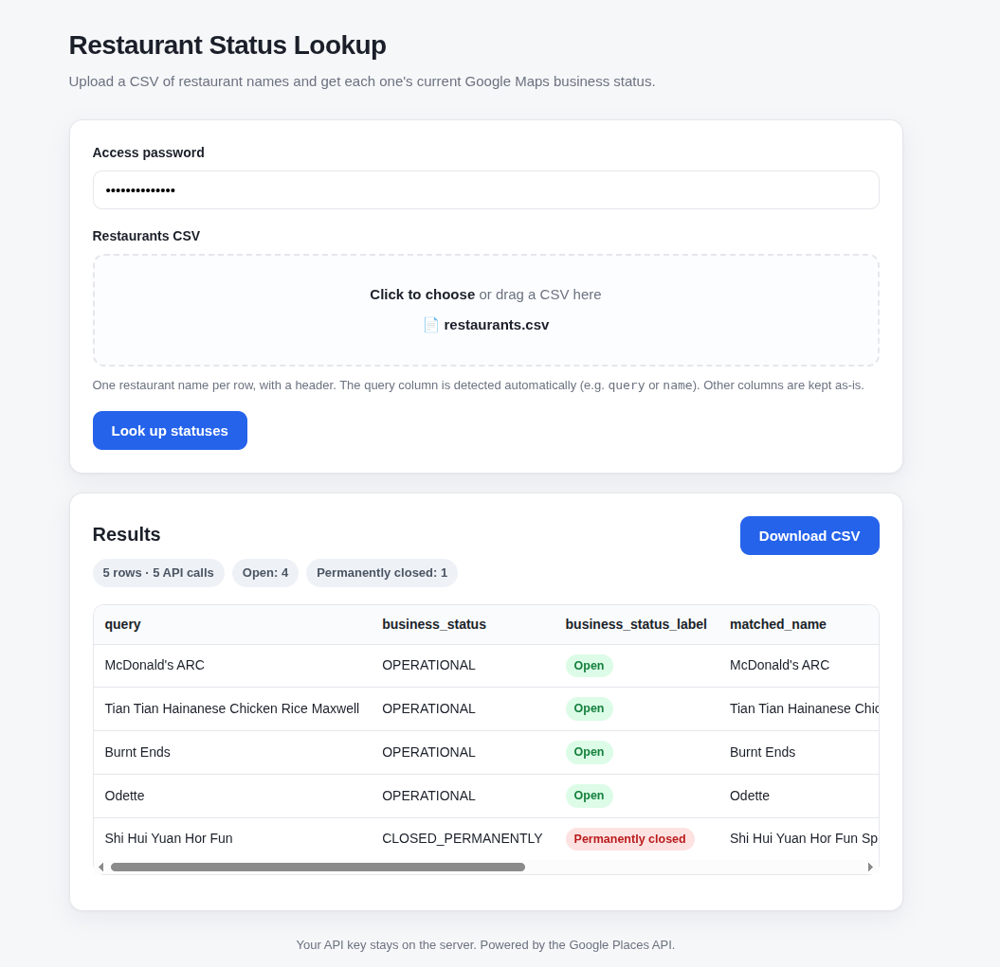

# places-api-bot

[](https://places-api-bot-git-claude-nice-meitner-sk537j-brelkhs-projects.vercel.app/)
[](https://places-api-bot-git-claude-nice-meitner-sk537j-brelkhs-projects.vercel.app/)

Look up the Google Maps **business status** (open / temporarily closed /
permanently closed) for a list of restaurants — as a **web app** or a **CLI**.



It reads a list of restaurant names, looks each one up with the Google
**Places API (New)** Text Search endpoint, and returns your original rows plus
the business status. The web app shows a results table you can download as a
CSV; the CLI reads `restaurants.csv` and writes `restaurant_status.csv`.

## Using the web app

**🔗 [Open the app](https://places-api-bot-git-claude-nice-meitner-sk537j-brelkhs-projects.vercel.app/)**
&nbsp;·&nbsp; ask the project owner for the shared **access password**.

1. **Enter the access password** (set by whoever deployed it, via the
   `APP_PASSWORD` setting).
2. **Choose or drag in a CSV** of restaurant names. It needs a header row and
   one name per line; the query column is detected automatically (a column
   named `query`, `restaurant`, `name`, … — otherwise the first column). Any
   extra columns you include are kept and passed straight through.
3. Click **Look up statuses**. Results appear as a colour-coded table —
   <kbd>Open</kbd>, <kbd>Temporarily closed</kbd>, <kbd>Permanently closed</kbd>,
   plus `Not found` / `Unknown` / `Error` when applicable.
4. Click **Download CSV** to save the full results (`restaurant_status.csv`).

### Tips

- **Add a city/area to ambiguous names.** The app appends `" singapore"` to
  every query, but a generic name like *"McDonald's"* still matches many
  outlets — *"McDonald's ARC"* or *"Tian Tian Maxwell"* lands the right one.
- **Check the `matched_name` / `matched_address` columns** to confirm the right
  place was matched, and use the **map ↗** link to eyeball it on Google Maps.
- **`Not found`** usually means the name was too vague or misspelled — try
  adding the mall, street, or neighbourhood.
- **Big lists:** a single upload is capped at **750 rows** (`MAX_ROWS`) so it
  finishes inside the request limit. Split larger files, or run the CLI locally
  for unlimited batches.
- The summary pills show the **row count and number of API calls** — duplicate
  names are looked up only once, so calls ≤ rows.

> The link above is the current preview deployment for this branch. After you
> merge to `main`, Vercel will also give you a stable production URL you can
> share instead.

## How it works

For each row it sends the query (with `" singapore"` appended) to the Text
Search endpoint, takes the best match, and records its `businessStatus`.

### Cost control

The request field mask is restricted to the **Pro** pricing tier — the cheapest
tier that still returns business status:

```
places.id, places.displayName, places.formattedAddress,
places.businessStatus, places.googleMapsUri
```

> **Note on the original example query:** it requested
> `places.currentOpeningHours.openNow`, which is an **Enterprise-tier** field and
> would have charged every call at the higher rate. It's intentionally left out.
> `businessStatus` already returns `OPERATIONAL`, `CLOSED_TEMPORARILY`, and
> `CLOSED_PERMANENTLY`, which is exactly what we need. `displayName` and
> `formattedAddress` are kept (still Pro tier) so you can eyeball whether the
> right restaurant was matched.

It also keeps a **local monthly call counter** (`.places_usage.json`) and warns
before a run would push the current month past a threshold (default `10000`,
matching the usual free allowance). The Google Cloud console remains the
authoritative source — this is just a guardrail.

## Setup

```bash
pip install -r requirements.txt
cp .env.example .env   # then put your key in it, OR just export the variable:
export GOOGLE_MAPS_API_KEY="your-key"
```

The key is read from the `GOOGLE_MAPS_API_KEY` environment variable, so it's
swappable via a `.env` file locally or a **GitHub Secret** in CI.

## Usage

```bash
python -m places_bot --input restaurants.csv --output restaurant_status.csv
```

### Input format

A CSV with a header row. The query column is auto-detected (it looks for a
column named `query`, `restaurant`, `restaurant_name`, or `name`, otherwise it
uses the first column). Override with `--query-column`. Any extra columns you
include are carried through to the output untouched.

```csv
query
McDonald's ARC
Tian Tian Hainanese Chicken Rice Maxwell
```

### Output

The same rows with these columns appended:

| column | meaning |
| --- | --- |
| `business_status` | raw Google value (`OPERATIONAL`, `CLOSED_TEMPORARILY`, `CLOSED_PERMANENTLY`, `NOT_FOUND`, `UNKNOWN`, `ERROR`) |
| `business_status_label` | friendly label (Open / Temporarily closed / …) |
| `matched_name` | name Google matched — check this looks right |
| `matched_address` | matched address |
| `google_maps_uri` | link to the place on Google Maps |

### Useful options

| flag | description |
| --- | --- |
| `--suffix " singapore"` | text appended to every query |
| `--query-column NAME` | force which column holds the query |
| `--threshold N` | warn above N estimated calls this month (default 10000) |
| `--yes` | don't prompt at the threshold (used in CI) |
| `--no-dedupe` | call the API even for repeated queries (costs more) |

Duplicate queries are de-duplicated by default so you're never charged twice
for the same lookup in one run.

## Running in GitHub Actions

A `workflow_dispatch` workflow (`.github/workflows/places-status.yml`) runs the
bot against a committed CSV and uploads `restaurant_status.csv` as an artifact.
Add your key under **Settings → Secrets and variables → Actions** as
`GOOGLE_MAPS_API_KEY`, then trigger it from the **Actions** tab.

## Web app (Vercel)

A browser version lives in [`public/index.html`](public/index.html) (the UI) and
[`api/process.py`](api/process.py) (a Flask serverless function that reuses the
same `places_bot` engine). Upload a CSV, get a results table, download the
output CSV — no terminal needed.

```
public/index.html   clean single-page UI (upload → results table → download)
api/process.py      serverless function: password gate → lookups → JSON + CSV
vercel.json         bundles the places_bot package with the function
```

The function looks up statuses **concurrently** (`PLACES_MAX_WORKERS`, default 8)
so a CSV finishes inside the request timeout, and your API key never leaves the
server.

### Deploy

1. Push this repo to GitHub and import it at [vercel.com/new](https://vercel.com/new)
   (no build settings needed — Vercel detects `public/` and `api/`).
2. In **Project → Settings → Environment Variables**, add:
   - `GOOGLE_MAPS_API_KEY` — your Places API key
   - `APP_PASSWORD` — the shared password you give your team
   - *(optional)* `MAX_ROWS` (default `750`), `PLACES_MAX_WORKERS` (default `8`)
3. Deploy. Share the URL + the password with your team.

Because it scales to zero, it costs nothing when idle; you only pay Google for
the Places API calls.

### Run the web app locally

```bash
pip install -r requirements.txt
export GOOGLE_MAPS_API_KEY="your-key" APP_PASSWORD="local-pass"
python api/process.py            # serves the API on http://localhost:5000
```

(For the full static-UI + function experience, `npm i -g vercel` then `vercel dev`.)

### Limits

`MAX_ROWS` caps a single upload (default 750) so a request can't outrun Vercel's
60s timeout. For bigger batches, split the file or use the CLI locally.

## Tests

```bash
pip install -r requirements-dev.txt
pytest
```

Tests stub the network, so no API key or quota is consumed.

## Roadmap

- [x] Host as a cheap web app with a clean upload-and-download UI
- [ ] Friendlier flow for non-technical users (e.g. per-user keys, saved jobs)
- [ ] Tighter quota dashboards / alerting
